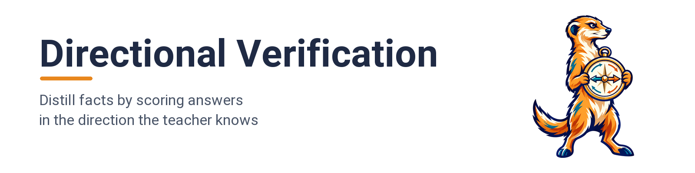
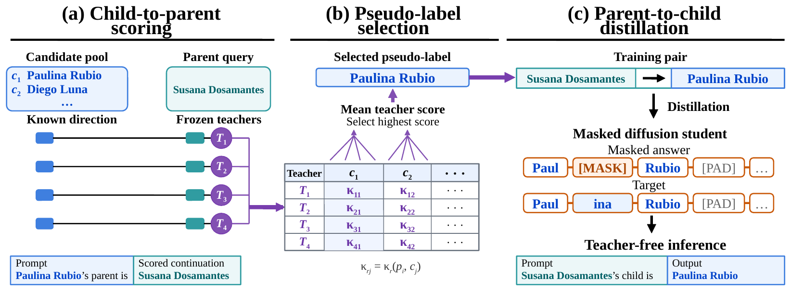
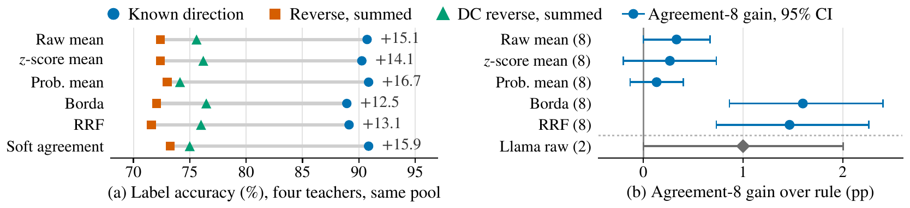

<p align="center">
  
</p>

<div align="center">

[](https://arxiv.org/abs/2610.00997)
[](LICENSE)
[](https://creativecommons.org/licenses/by/4.0/)
[](https://www.python.org/)
[](https://github.com/js-lee-AI/directional-verification/actions/workflows/ci.yml)
[](https://github.com/js-lee-AI/directional-verification/stargazers)

<b><a href="#quick-start">Quick start</a> · <a href="#usage">Usage</a> · <a href="#command-line">CLI</a> · <a href="#results">Results</a> · <a href="#reproduce-the-paper">Reproduce</a> · <a href="#faq">FAQ</a> · <a href="#citation">Citation</a></b>

</div>

---

## News

- **[2026-09-28]** Code released, with the bundled teacher scores and student outputs and scripts that check 587 values from the paper's tables.

## Overview

A teacher may recall a relation in one direction and still fail to generate the answer in the reverse direction. Distilling its generated answers passes that failure on to the student. The same teacher can often recognize the right answer when it scores the relation in the direction it knows. This repository turns that check into training labels for parent to child questions.

Directional label distillation rests on three ideas.

* **Score in the known direction.** Frozen teachers score the query parent as the continuation of `{child}'s parent is` for every candidate child (eq. 1).
* **Select by the mean score.** The candidate with the highest four-teacher mean, other than the queried parent, becomes the pseudo-label (eq. 2), and a masked diffusion student learns the parent to child pairs.
* **Better labels, better students.** On the screened cohort's exposure-free queries, known-direction labels improve student open accuracy by 14.77 points over summed-token DC labels. On the unscreened cohort the gains are 13.09 to 15.36 points over summed DC and transferred tuned-reverse labels (Section 4.1).

This repository is label selection, teacher scoring and the student recipe as a small library, plus the data and scripts that rebuild the paper's tables.

## What it does in one picture

<p align="center">
  
</p>

<p align="center"><em>Frozen teachers score the same query parent after each candidate child (a). The candidate with the highest mean teacher score becomes the pseudo-label (b), and a masked diffusion student learns to answer reverse queries without teachers (c).</em></p>

## Quick start

```bash
pip install "git+https://github.com/js-lee-AI/directional-verification.git"
```

```python
import ddv

parent = "Susana Dosamantes"
candidates = ["Paulina Rubio", "Diego Luna", "Odiseo Bichir", "Selena Gomez"]
known = [[-2.46, -2.93, -2.87, -4.23]]        # parent after "{child}'s parent is", per token
reverse = [[-15.61, -13.60, -23.71, -14.30]]  # child after "{parent}'s child is", summed
context = [[-24.78, -21.12, -35.68, -18.51]]  # child after "The child is", summed

print("known direction:", ddv.select_label(known, candidates, parent))
print("reverse:        ", ddv.select_label(reverse, candidates, parent))
print("reverse with DC:", ddv.select_label(ddv.domain_context(reverse, context), candidates, parent))
# known direction: Paulina Rubio
# reverse:         Diego Luna
# reverse with DC: Odiseo Bichir
```

The scores are the stored four-teacher means for four of the 17 candidates of the query in Figure 1, rounded, and Paulina Rubio is its recorded child. The reverse score prefers a name that is probable on its own, and subtracting the context-only score (eq. 3) overshoots to a less probable one. This runs on a CPU in well under a second and downloads nothing. The same code is [`examples/quickstart.py`](examples/quickstart.py).

To score candidates with a real teacher or train a student, install the `train` extra.

```bash
pip install "directional-verification[train] @ git+https://github.com/js-lee-AI/directional-verification.git"
```

| install | adds | enough for |
|---|---|---|
| `pip install "git+https://github.com/js-lee-AI/directional-verification.git"` | numpy | label selection, the metrics, the quickstart, the `ddv` command |
| `pip install "directional-verification[train] @ git+https://github.com/js-lee-AI/directional-verification.git"` | torch, transformers, peft, accelerate | teacher scoring and student training |
| `git clone` and then `pip install -e ".[train,test]"` | pytest | the bundled data, `experiments/` and `tests/` |

The paper's student runs used Python 3.11, PyTorch 2.11.0, Transformers 5.12.1, PEFT 0.19.1 and CUDA 12.8 on RTX A6000 and A100 GPUs.

## Usage

### Score candidates with a teacher

```python
import ddv

candidates = ["Paulina Rubio", "Diego Luna", "Odiseo Bichir", "Selena Gomez"]
model, tokenizer = ddv.load_teacher({"model": "Qwen/Qwen3-8B"}, "cuda")
known = ddv.score_candidates(model, tokenizer, "Susana Dosamantes", candidates)   # eq. 1
reverse = ddv.score_candidates(model, tokenizer, "Susana Dosamantes", candidates, direction="reverse")
```

`score_candidates` returns one mean-token log probability per candidate, of the parent after each child in the known direction and of each child after the parent in the reverse direction. Prompts are raw, with no chat template. Stack one row per teacher into a `(teachers, candidates)` array and pass it to `ddv.select_label`. The paper uses Qwen3-8B, OLMo-2-7B, Mistral-7B-v0.3 and Llama-3.1-8B-Instruct at the revisions pinned in [`configs/teachers.json`](configs/teachers.json).

### Select labels for a whole pool, no GPU

```python
import ddv

pool = ddv.load_pool("screened", "data")
channels = ddv.load_scores("screened", "data")["known_mean"]   # one channel per teacher
labels = ddv.select_labels(pool["queries"], channels)          # eq. 2
print(f'{ddv.label_accuracy(pool["queries"], labels, ddv.load_inventory("data")):.2f}')
# 90.73
```

`rule` switches to the other aggregation rules of Table 4 (`zscore`, `probability`, `borda`, `rrf`, `agreement`), and `forms=("dc_sum",)` loads the summed DC reverse scores instead. This needs a clone, since the scores live in `data/`.

### API at a glance

| call | what it does | needs |
|---|---|---|
| `ddv.select_label(scores, candidates, parent, rule="mean")` | pseudo-label for one query from a `(teachers, candidates)` array | base install |
| `ddv.select_labels(queries, channels, rule="mean")` | pseudo-labels for a pool, with shape and NaN checks | base install |
| `ddv.domain_context(reverse, context, lam=1.0)` | the DC reverse score of eq. 3 | base install |
| `ddv.load_pool`, `ddv.load_scores`, `ddv.load_inventory` | the bundled pools, score forms and corpus | base install and a clone |
| `ddv.evaluate_predictions(dataset, child_parents, predictions)` | open, whole-answer and inventory-matched accuracy | base install |
| `ddv.load_teacher`, `ddv.score_candidates`, `ddv.score_pairs` | known-direction, reverse and context-only teacher scores | `[train]` |
| `ddv.train_student(dataset, child_parents, config, out)` | forward warm stage, mixed SFT and evaluation of one MDM student | `[train]` and a GPU |

Calls marked base install import without torch. Heavy modules load the first time one of their names is used.

## Command line

Installing the package adds a `ddv` command, and `python -m ddv` runs the same thing.

```bash
ddv --help
ddv demo                                   # the quickstart, on CPU
ddv validate                               # rebuild every bundled label from the bundled scores
ddv select --data pool.json --scores qwen.json olmo.json mistral.json llama.json --out labeled.json
ddv evaluate --data data/screened.json \
    --predictions data/predictions/screened_known_mean_seed0.json.gz --out results/seed0.json
ddv summarize --runs runs/seed0 runs/seed1 runs/seed2   # mean and sample SD over student runs
```

`ddv evaluate` on the stored run above prints 80.29 open, 80.00 whole-answer and 89.28 matched accuracy, the run A row of Table 10.

## Results

Students trained on known-direction labels answer reverse queries more accurately than students trained on prior-corrected reverse labels, and the gap follows label accuracy.

<p align="center">
  
</p>

### MDM-0.6B students trained on selected reverse labels (paper Table 1)

Three-seed mean ± sample SD in percent. x is label accuracy. Open, Whole and Matched are student accuracy against any true child, and the last two columns give the share of outputs that reproduce the selected label as a whole string or after inventory matching. The acquired pools are scored on the 1,390 exposure-free queries of the screened cohort, the uniform and lexical lists on the 512 queries of the unscreened cohort.

| label source | x | Open | Whole | Matched | String | Inventory |
|---|---|---|---|---|---|---|
| *Acquired pools* | | | | | | |
| Reverse, mean token | 53.60 | 47.17 ± 1.29 | 47.00 ± 1.27 | 53.14 ± 0.41 | 79.59 ± 1.74 | 97.67 ± 0.30 |
| DC reverse, mean token | 54.82 | 49.26 ± 0.08 | 49.06 ± 0.07 | 53.93 ± 0.48 | 90.36 ± 0.29 | 97.65 ± 0.79 |
| DC reverse, summed token | 75.18 | 63.26 ± 1.30 | 63.14 ± 1.37 | 73.98 ± 0.23 | 79.98 ± 1.35 | 97.39 ± 0.51 |
| **Known direction, mean token** | 90.72 | 78.03 ± 2.86 | 77.75 ± 2.91 | 88.94 ± 0.46 | 84.56 ± 3.02 | 97.70 ± 0.61 |
| Llama two-template mean | 90.29 | 75.11 ± 3.49 | 74.87 ± 3.42 | 88.23 ± 0.76 | 81.61 ± 3.94 | 97.24 ± 0.91 |
| Eight-channel agreement | 91.58 | 79.09 ± 0.80 | 78.78 ± 0.59 | 89.78 ± 0.07 | 84.96 ± 0.92 | 97.67 ± 0.18 |
| *Uniform lists* | | | | | | |
| DC reverse, summed token | 73.44 | 71.88 ± 0.59 | 71.88 ± 0.59 | 73.24 ± 0.00 | 97.33 ± 0.11 | 99.74 ± 0.11 |
| Tuned reverse, transferred | 74.61 | 72.20 ± 0.81 | 72.07 ± 0.78 | 74.35 ± 0.11 | 96.81 ± 1.27 | 99.61 ± 0.20 |
| **Known direction, mean token** | 87.89 | 85.29 ± 0.56 | 85.22 ± 0.63 | 87.50 ± 0.20 | 96.81 ± 0.60 | 99.48 ± 0.11 |
| *Lexical lists* | | | | | | |
| DC reverse, summed token | 55.86 | 54.49 ± 0.70 | 54.49 ± 0.70 | 55.79 ± 0.11 | 97.07 ± 0.68 | 99.67 ± 0.30 |
| Tuned reverse, transferred | 57.23 | 55.66 ± 0.59 | 55.60 ± 0.49 | 57.10 ± 0.23 | 97.59 ± 0.69 | 99.87 ± 0.23 |
| **Known direction, mean token** | 71.29 | 69.86 ± 0.45 | 69.79 ± 0.56 | 71.09 ± 0.20 | 97.59 ± 0.69 | 99.80 ± 0.20 |

Bold rows are the primary known-direction labels, which the paper highlights in blue. `python experiments/table1_students.py` rebuilds the eight rows whose teacher scores and student outputs are bundled and checks each value against the paper. The Llama two-template, eight-channel and tuned reverse rows need score files that are not bundled.

### Direction control on the 1,500 acquired pools (paper Table 4)

Label accuracy in percent with four teachers and the main template. Known uses mean-token scores, and DC subtracts the summed context-only score. The last columns compare known with summed DC.

| aggregation | Known | Reverse, mean | Reverse, summed | DC, sum | Known − DC, points | W/L | Holm p |
|---|---|---|---|---|---|---|---|
| Raw-score mean | 90.73 | 54.60 | 72.40 | 75.60 | 15.13 | 259/32 | 1.0 × 10<sup>−44</sup> |
| z-score mean | 90.27 | 54.27 | 72.40 | 76.20 | 14.07 | 248/37 | 4.8 × 10<sup>−39</sup> |
| Probability mean | 90.87 | 54.27 | 73.00 | 74.13 | 16.73 | 280/29 | 6.0 × 10<sup>−52</sup> |
| Borda | 88.93 | 55.20 | 72.07 | 76.47 | 12.47 | 226/39 | 3.4 × 10<sup>−33</sup> |
| RRF | 89.13 | 54.53 | 71.60 | 76.00 | 13.13 | 236/39 | 3.1 × 10<sup>−35</sup> |
| Soft agreement | 90.87 | 54.33 | 73.27 | 75.00 | 15.87 | 266/28 | 4.0 × 10<sup>−49</sup> |

The known direction leads under every rule, while the rules differ by at most 2.33 points within a score form. `python experiments/table4_aggregation.py` rebuilds every entry except the paper's bootstrap intervals, which are left out here.

## Reproduce the paper

```bash
git clone https://github.com/js-lee-AI/directional-verification.git
cd directional-verification
pip install -e ".[test]"          # add train for teacher scoring and student training
```

[`data/`](data) holds everything the table scripts read, about 13 MB. It has the Wikidata corpus (CC0), the three candidate pools, the known-direction and reverse scores of all four teachers, and the stored answers of the trained students. [`data/README.md`](data/README.md) lists the files and their formats.

Each table script rebuilds its values from these files on a CPU, prints the rows next to the paper's values and exits with an error on any difference. On our CPU each one takes between one and fifteen seconds.

| paper | command | what it checks |
|---|---|---|
| Table 1, Section 4.1 | `python experiments/table1_students.py` | 8 of 12 rows, all columns |
| Table 4, Figure 2a, Appendix B | `python experiments/table4_aggregation.py` | all entries except the intervals |
| Table 5 | `python experiments/table5_dc_mean.py` | all entries |
| Tables 7 and 8, Figure 3 | `python experiments/table7_name_prior.py` | all entries, intervals included |
| Tables 9 and 10, Appendix C | `python experiments/table9_runs.py` | Table 9 for 3 of 5 label sources, all of Table 10 |
| Tables 11 and 12, Appendix D | `python experiments/table11_label_transfer.py` | all entries |
| Table 13 | `python experiments/table13_teachers.py` | the main-template rows |
| Table 14, Table 24 | `python experiments/table14_gains.py` | Table 14 main-template gains, the corpus parent rows of Table 24 |
| Table 15 | `python experiments/table15_surname.py` | the main-template rows |
| Table 17 | `python experiments/table17_unscreened_runs.py` | all entries except the intervals |
| Table 18, Figure 4a | `python experiments/table18_comparators.py` | the three teacher-scored rows |
| Table 19 | `python experiments/table19_tuned_reverse.py` | the background rows and the acquired-pool contrast |
| Tables 27a and 29a | `python experiments/table27_surname_students.py` | all of 27a, 3 of 5 rows of 29a |

Together these check 587 printed values, and all of them match. `pytest` runs every script, and `ddv validate` confirms that the bundled labels are exactly what eq. 2 selects from the bundled scores.

The GPU steps that produced the bundled files are scripts too.

| step | command | hardware | time |
|---|---|---|---|
| acquire candidates | `python experiments/acquire_candidates.py scan` and `merge` | 1 GPU, bf16 | not timed separately |
| score a pool | `python experiments/score_teachers.py --pool data/screened.json --teacher qwen --out ...` | 1 GPU, bf16 | not timed separately |
| train one student | `python experiments/train_student.py --pool screened --labels known_mean --seed 0 --out runs/k0` | 1x RTX A6000 or A100 | about 1 h per seed on an RTX A6000 |
| reload a student | `python experiments/evaluate_student.py --run runs/k0 --out results/k0.json` | 1 GPU | minutes |

Student rows use seeds 0, 1 and 2, which the paper calls runs A, B and C, and report the mean with the sample SD. GPU class is matched within each run and differs across runs (Appendix C), so a retrained seed can land a little away from its stored run. The training recipe is in [`configs/student.json`](configs/student.json).

## Repository layout

```
ddv/scores.py              prompts, the known-direction and reverse scores, the DC correction (eq. 3)
ddv/labels.py              label selection under the six aggregation rules (eq. 2, Appendix A)
ddv/data.py                the bundled corpus, pools and score forms
ddv/metrics.py             open, whole-answer and inventory-matched accuracy, McNemar and Holm
ddv/teacher.py             teacher scoring, needs the train extra
ddv/student.py, train.py   the masked diffusion student and its training run, need the train extra
ddv/cli.py                 the ddv command
examples/quickstart.py     the CPU demo shown above
experiments/               one script per paper table, plus the GPU steps
data/                      corpus, pools, teacher scores and stored student answers
tests/                     CPU tests, including every table script
```

## FAQ

<details>
<summary><b>Do I need a GPU?</b></summary>

Not for label selection, the metrics or any table script. They use numpy only and read the bundled scores and student answers. Scoring new candidates with a teacher and training a student need the `train` extra and a GPU with bf16.

</details>

<details>
<summary><b>Does label selection look at the recorded answer?</b></summary>

No. `select_labels` sees only the queried parent, the candidates and the teacher scores, and it never returns the queried parent itself (Section 2). The recorded child is used only to score the labels and the students.

</details>

<details>
<summary><b>What is the name-prior (DC) correction?</b></summary>

A reverse score rewards names that are probable on their own. The DC reverse score subtracts each candidate's score after the context-only prompt `The child is` (eq. 3), following domain-conditional PMI. Its summed-token form gives the most accurate reverse labels without a tuned coefficient, and known-direction labels still exceed them by 12.47 to 16.73 points under all six aggregation rules (Section 4.2).

</details>

<details>
<summary><b>Why do my retrained students differ from the paper?</b></summary>

Student accuracy varies across seeds by up to a few points (Table 1 reports the sample SD), and the paper's runs used different GPU classes across seeds. The label accuracies do not depend on training and are rebuilt exactly from the bundled scores.

</details>

## Citation

If you use this code, please cite the paper.

```bibtex
@article{lee2026distilling,
  title   = {Distilling Directional Verification},
  author  = {Lee, Jungseob and Eo, Sugyeong and Hong, Seongtae and Lee, Seungyoon and Park, Chanjun and Seo, Jaehyung and Lim, Heuiseok},
  journal = {arXiv preprint arXiv:2610.00997},
  year    = {2026},
  url     = {https://arxiv.org/abs/2610.00997}
}
```

The Cite this repository button in the GitHub sidebar gives the same entry from [`CITATION.cff`](CITATION.cff).

## License

Code is MIT, see [LICENSE](LICENSE). The paper is CC BY 4.0. The bundled Wikidata facts are CC0.

## Acknowledgments

The facts come from [Wikidata](https://www.wikidata.org). The teachers are [Qwen3-8B](https://huggingface.co/Qwen/Qwen3-8B), [OLMo-2-7B](https://huggingface.co/allenai/OLMo-2-1124-7B), [Mistral-7B-v0.3](https://huggingface.co/mistralai/Mistral-7B-v0.3) and [Llama-3.1-8B-Instruct](https://huggingface.co/meta-llama/Llama-3.1-8B-Instruct), and the students start from [Qwen3-0.6B](https://huggingface.co/Qwen/Qwen3-0.6B).
